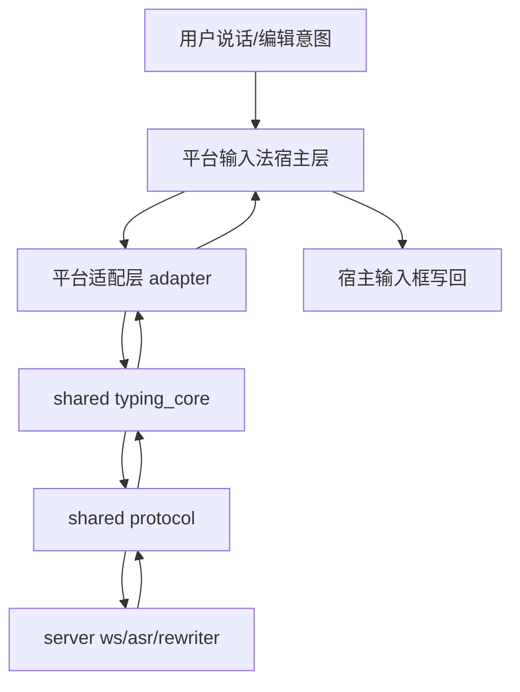

# 对标 Typeless 的四端输入法 Monorepo 方案

## 1. 文档目的

本文档用于把“一个仓库同时做 macOS、Windows、iOS、Android 输入法”落成可执行架构。

目标不是做多端壳应用，而是做真正的系统级输入法能力：

1. 跨应用输入框写回
2. 实时语音输入与会话级编辑
3. 风格保真与术语一致性
4. 输入法状态可观测（识别中、改写中、写回成功/失败）

## 2. 对标 Typeless 的核心指标

后续所有设计与排期，优先围绕这四个指标：

1. 实时感：用户说话时，能持续看到增量结果
2. 会话编辑感：支持“上一句删掉、改成列表、语音修改已选内容”
3. 跨应用写回成功率：在常见宿主输入框稳定可用
4. 风格保真度：尽量保留用户语气，不把所有文本改成统一公文腔

## 3. Monorepo 目录蓝图

```text
typeink/
├─ server/                             # 现有实时后端（ASR/重写/WS）
├─ shared/
│  ├─ protocol/                        # 输入法统一协议（状态事件、写回结果事件）
│  ├─ typing_core/                     # 输入法核心状态机（平台无关）
│  ├─ rewrite_policy/                  # 风格模式、术语词典、应用画像
│  └─ qa_scenarios/                    # 统一回归样例（对标 Typeless 用例）
├─ macos_输入法/
│  ├─ host/                            # InputMethodKit 宿主实现
│  └─ adapter/                         # 平台事件 -> shared 协议
├─ windows_输入法/
│  ├─ host/                            # TSF/IME 宿主实现
│  └─ adapter/
├─ android_输入法/
│  ├─ host/                            # InputMethodService 宿主实现
│  └─ adapter/
├─ ios_输入法扩展/
│  ├─ host/                            # Keyboard Extension 宿主实现
│  └─ adapter/
├─ tools/
└─ docs/
```

说明：目录名用中文是为了提升可读性；若后续接入构建工具要求英文，再统一改为英文命名。

## 4. 架构分层（输入法核心）



分层原则：

1. `shared/*` 只做平台无关逻辑，避免四端重复实现。
2. 平台差异全部收敛在 `adapter` 与 `host`。
3. `server` 保持可替换模型架构，不与具体平台强耦合。

## 5. 平台能力矩阵（现实边界）

| 平台 | 系统输入法能力 | 语音输入自由度 | 写回复杂度 | 结论 |
|---|---|---|---|---|
| macOS | 高 | 高 | 中 | 建议首发平台 |
| Windows | 高 | 高 | 中高 | 建议第二平台 |
| Android | 高 | 高 | 中 | 建议第三平台 |
| iOS | 受限（Keyboard Extension） | 受系统与扩展限制 | 高 | 需单独降级方案 |

重要提醒：iOS 键盘扩展能力限制明显，不应强求和其余三端完全同功能。

## 6. 分阶段里程碑（对标 Typeless）

### P0（先打通一个平台）

目标：`macOS 输入法 MVP`

完成标准：

1. 可在常见输入框唤起
2. 可启动语音并回流文本
3. 可执行基础会话编辑（至少 2 个指令）
4. 可写回输入框并可观测成功/失败

### P1（复制到桌面双平台）

目标：`Windows 输入法接入`

完成标准：

1. 复用 shared 协议与状态机
2. 通过同一组 `qa_scenarios` 回归
3. 写回稳定性达到可内测水平

### P2（移动端输入法）

目标：`Android 输入法接入 + iOS 降级版`

完成标准：

1. Android 达到接近桌面体验
2. iOS 明确“可做/不可做”边界并形成产品方案
3. 四端事件协议保持一致

### P3（对标 Typeless 的产品化）

目标：从“可用”走向“好用”

完成标准：

1. 应用画像与风格策略完善
2. 术语词典与个性化能力增强
3. 写回失败兜底与可恢复机制完善

## 7. 协议与状态事件（建议先固定）

建议在 `shared/protocol` 先固定两类事件：

1. 输入法状态事件：
   - `idle`
   - `listening`
   - `rewriting`
   - `applied`
   - `failed`

2. 写回结果事件：
   - `writeback_success`
   - `writeback_fallback_clipboard`
   - `writeback_failed`

这两类事件是对齐 Typeless 体验的关键基础设施。

## 8. 下一步可直接执行的动作

1. 在仓库先落地骨架目录：`shared/` 与 `macos_输入法/`
2. 定义 `shared/protocol` 的第一版 schema（状态与写回结果）
3. 只做 macOS MVP，不并行启动四端
4. 用现有 `server` 做后端，不重写链路

---

维护原则：

1. 每次里程碑变更后同步更新本文件。
2. 如果调整了平台优先级或协议字段，先更新文档再改代码。
